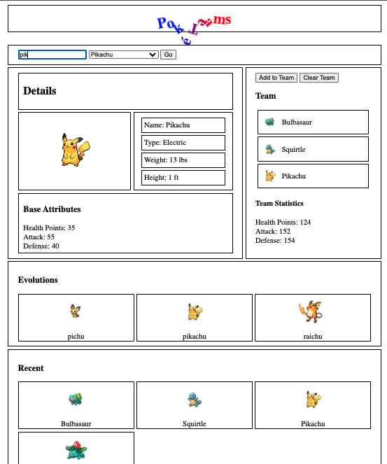

# Pokemon - Outside Class
Starting with the code from Pokemon-In-Class

## Introduction

Starting with the code from Pokemon In Class.  This project, Pokemon Outside Class - is to continue working on this....outside of class!  Will be adding: additional features, testing pieces of code, practicing some of the things we have learned.

### Current Site (Pokemon-in-class)
This is a screenshot of how our site looks so far:

## Additional Features

This project is adding additional features to our Pokemon Web Application.

Recently added during pokemon-in-class:
* CSS animation to Header
* Evolutions list
* Typing letters into input to sort Pokémon dropdown list
* Converted Hectograms to lbs, and Decimeters to ft.

### Optional Ideas

* Halloween Themed Pokémon (Spooky Pokémon, Horror version of Pokémon)
* What a Pokédex looks like

## Things to Include

Entirely up to you what you want to include:

* Have text input work for capitalized letters when searching/filtering the Pokémon list
* Clear only one Pokémon from the team instead of all.
* Capitalize each of the Pokémon names in Evolutions list
* Make Evolutions pokémon clickable in some way?
* Include additional information from the API that might be interesting in the Details section
* Add some background colors/images, fonts, borders
* Change CSS Grid layout, add/move elements.

A few suggestions:

* Functions, Higher order functions
* Higher order array methods
* Forms
* CSS Box Model, CSS Grid
* Media Queries
* API Calls, Fetch
* Creating elements with the DOM
* Event listeners, forms with events
* Promises (.then, .catch)
* Error Handling
* Async/Await
* CSS Animations

## Add More!

This project has no limits to the amounts of things to add. Get creative!

Be mindful of media queries in the CSS, and make the site work well for both desktop-first and smaller screens.

## Share your code!

Deploy your site using GitHub Pages.

## Continue this README

Practice writing READMEs using Markdown!